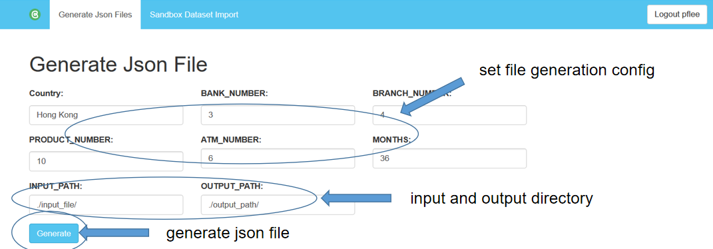
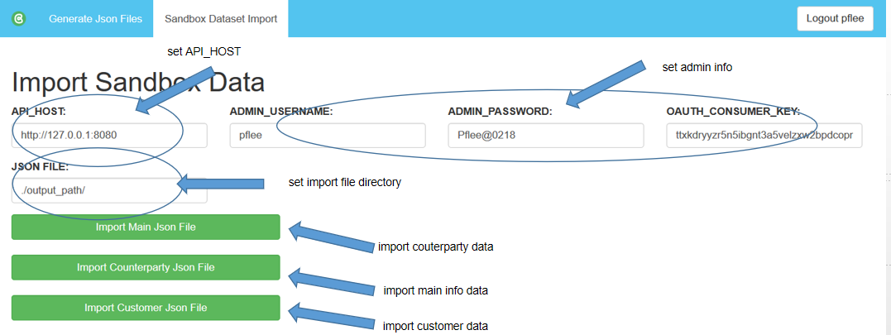

# OBP-Sandbox-Generator-Interface

This is a Django project to generate sandbox dataset and import them to server.

It currently supports three authentication methods: OAuth1.0a, Gateway Login and Direct Login


# Installation (development)

It is assumed that the git checkout resides inside a project directory, e.g. inside `/var/www/apitester` and thus to be found at `/var/www/apitester/API-Tester`.
Paths below are relative to this README. Files produced during installation or at runtime should be outside the git checkout, but inside the project directory, except for Django's local settings. 
The directory tree might look like:

```bash
$ tree -L 2 OBP-Sandbox-Generator-Interface/
OBP-Sandbox-Generator-Interface/
├── OBP-Sandbox-Generator-Interface
│   ├── apigenerator
│   ├── base
│   ├── objects
│   ├── obp
│   └── runtests
├── LICENSE
├── README.md
├── requirements.txt
├── NOTICE
├── gunicorn.conf.py
└── apigenerator.service
```


## Install dependencies

```bash
$ /usr/bin/virtualenv --python=python3 ../venv
$ source ../venv/bin/activate
(venv)$ pip install -r requirements.txt
```

## Conifguration
### Configure file generation settings
In the settings.py, you can set default values of related parameters. You can also set these parameters in web page.
```bash
INPUT_PATH = "./input_file/"
DATASET_PATH = "{}dataset.xlsx".format(INPUT_PATH)
OPTIONS_PATH = "{}options.xlsx".format(INPUT_PATH)

MONTHS = 36
BANK_NUMBER=3
BRANCH_NUMBER=4
ATM_NUMBER=6
PRODUCT_NUMBER=10
COUNTRY='Hong Kong'
```
### Configure api host
In the settings.py, you can set default values of related parameters. You can also set these parameters in web page.
The application's authentication is API-driven. However, to make use of Django's authentication framework to store generation parameter and import parameter. Here is an example for PostgreSQL:

```bash
REDIRECT_URL = 'http://127.0.0.1:9090'
OAUTH_CONSUMER_KEY = '*'
OAUTH_CONSUMER_SECRET = '*'

DATABASES = {
    'default': {
        'ENGINE': 'django.db.backends.postgresql_psycopg2',
        'NAME': '*',
        'USER': '*',
        'PASSWORD': '*',
        'HOST': '*',
        'PORT': '*',
    }
}


ADMIN_USERNAME = "*"
ADMIN_PASSWORD = "*"
FILE_ROOT = "./output_path/"
OUTPUT_PATH = './output_path/'
```

## Run the app

```bash
(venv)$ ./apitester/manage.py runserver 9090
```

The application should be available at `http://localhost:9090`.

### Json file Generation Page

### Import Data Page


You need to prepare dataset file: counterparties.xlsx, dataset.xlsx and options.xlsx. Sandbox data is picked 
randomly from these dataset and generated to sandbox data. These files can be assigned in generation page.
- counterparties.xlsx is dataset of counterparties information. Columns are type, counterparty_name	example_reference, 
typical_value, typical_frequency, counterparty_logo, counterparty_homepage
- dataset.xlsx is  dataset of main information, including branches, atms, products, currency
- options.xlsx has user behavior dataset.

The output will be three files in output dir which is assigned in generation page. sandbox_pretty.json, 
counterparty_pretty.json, customers_pretty.json


# Authentication


## OAuth

When selecting `OAuth` for authentication, the user is redirected to the login screen of the API from which the user is then redirected back to the API Tester. For this to work, the API Tester needs to be a registered consumer and the `OAUTH_` settings need to be set correctly.


## DirectLogin

Before being able to use `DirectLogin`, the user needs to create a consumer at the API, e.g. http://127.0.0.1:8080/consumer-registration because the user needs to supply a consumer key in addition to username and password.


## GatewayLogin

For `GatewayLogin` to work, the user's provider has to be set to `Gateway` in field `resourceuser`.`provider_` in the database. The user also needs to know the pre-shared secret between the gateway and the API.

Note: 

Please submit an issue on GitHub if something bugs you! 


# Final words

Be aware of file permission issues and preconfigured paths to executables (system env versus virtual env)!

Enjoy,
 TESOBE
